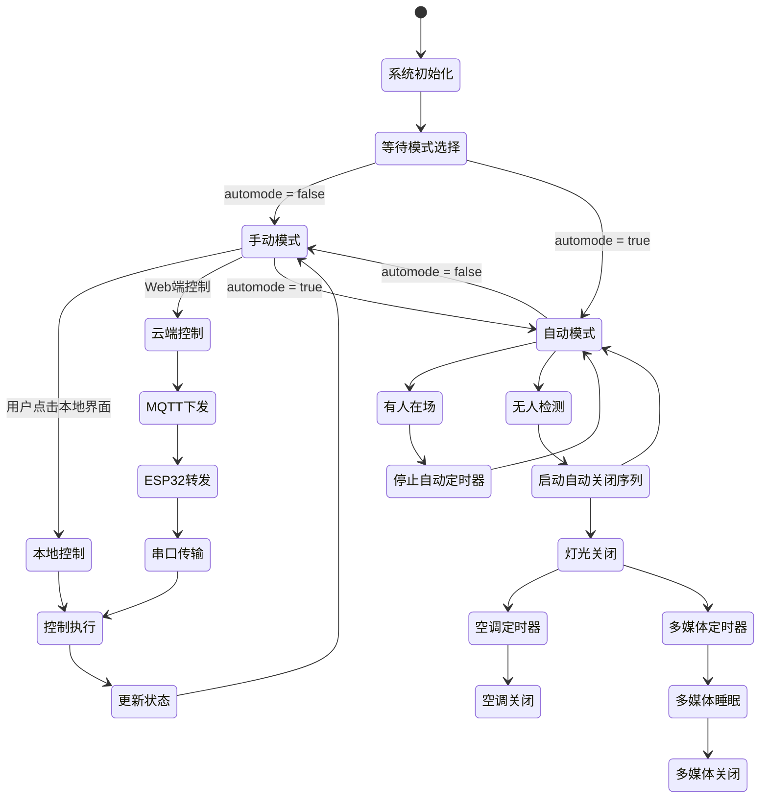
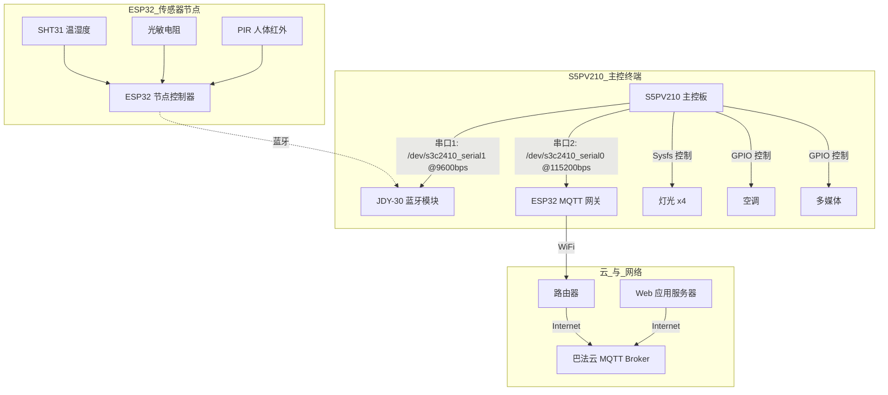
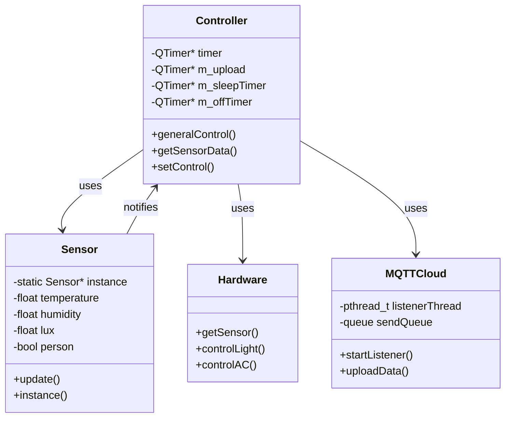

# 智慧教室物联网系统工程报告 (V2 - 详细版)

## 1. 项目概述

本项目是一个综合性的智慧教室物联网管理系统，旨在通过现代物联网技术实现对教室环境和设备的智能化监控与管理。系统整合了嵌入式硬件、无线通信技术和Web应用，构成一个完整的"设备-网关-云-应用"四层架构，实现了从底层硬件控制到上层云端应用的全面覆盖。

- **设备端 (Device):** 以 **S5PV210** 开发板为核心，运行基于 **Qt 5** 的C++应用程序。它不仅是与用户直接交互的终端，也是执行所有控制逻辑的中央处理器。
- **网关端 (Gateway):** 采用两个 **ESP32** 模块。一个作为**传感器数据采集节点**，通过蓝牙将数据发送给主控；另一个作为**MQTT通信网关**，通过串口将主控设备接入互联网，实现了解耦和模块化。
- **云端 (Cloud):** 采用公有MQTT云服务（**巴法云**）作为消息代理，为设备和Web后台之间提供了稳定、低延迟的异步消息通道。
- **应用端 (Application):** 提供一个基于 **Vue.js (前端)** 和 **Python FastAPI (后端)** 的Web控制台。它不仅是一个数据看板和控制器，更是一个功能强大的物联网平台，集成了数据持久化、历史分析、自定义自动化和AI服务能力。

该系统通过精巧的软硬件协同设计，不仅提升了教室管理的便捷性，也通过智能自动化策略，实现了显著的节能环保效果。

## 2. 主要功能

- **实时环境监测:** 7x24小时不间断地监测教室内的**温度(℃)**、**相对湿度(%)**、**光照强度(lux)**以及**是否有人活动(PIR)**。数据刷新频率为1秒一次。
- **设备远程控制:** 用户可以通过Web界面或本地Qt界面，远程独立控制：
  - **四盏LED灯**的独立开关。
  - **空调**的开关、模式（制冷/制热）和风速等级（1/2/3档）。
  - **多媒体设备**的状态（开启/睡眠/关闭）。
- **智能自动模式:**
  - **无人自动关闭策略:** 在自动模式下，当PIR传感器在一段时间内未检测到人体活动时：
    1. **立即**关闭所有已开启的灯光。
    2. **3秒后**，若空调仍处于开启状态，则自动关闭空调。
    3. **5秒后**，若多媒体设备处于"开启"状态，则自动切换到"睡眠"模式。
    4. **再过5秒** (累计10秒)，若多媒体设备仍处于"睡眠"状态，则自动彻底关闭。
  - **入室自动恢复:** 当PIR传感器再次检测到有人时，所有正在进行的自动关闭倒计时（针对空调和多媒体）将**立即中止**，保持设备在用户进入时的状态，避免错误操作，将控制权交还给用户。
- **Web仪表盘:**
  - **实时面板:** 使用仪表盘和数字卡片展示从`/latest` API获取的最新数据。
  - **历史图表:** 提供一个交互式图表，用户可以选择日期范围和数据类型（温度、湿度、功率等），查询并可视化历史数据趋势。
- **自定义自动化规则:** Web端提供一个**自动化管理器**，允许用户创建、编辑、启用/禁用和删除自定义规则。例如，可以设定一条规则："每周一至周五的早上08:00，自动开启2号和3号灯"。
- **AI集成服务:** Web端提供一个**聊天机器人**界面，用户可以通过自然语言查询设备状态或进行控制（如输入"现在教室里热吗？"或"把空调调到24度"），后端通过调用大模型（OpenAI, Dashscope）API来理解意图并执行相应操作。

系统自动控制的状态图如下

## 3. 硬件连接关系 

系统的硬件连接经过精心设计，确保各模块职责分明，稳定运行。




- **传感器节点 (Sensor Node):** 独立的ESP32模块。
  - **连接:** 通过I2C连接SHT31，ADC(GPIO34)连接光敏电阻，数字IO(GPIO33)连接PIR传感器。
  - **角色:** 作为蓝牙**主设备**（`ESP32_Master`），主动连接名为`QRS0327`的从设备（即JDY-30），配对码`0327`。
- **主控终端 (Main Control Terminal):** S5PV210开发板。
  - **蓝牙串口:** 通过`/dev/s3c2410_serial1`（波特率9600）与JDY-30模块通信，获取传感器数据。
  - **MQTT串口:** 通过`/dev/s3c2410_serial0`（波特率115200）与ESP32 MQTT网关通信，收发云端数据和指令。
  - **设备控制:** 通过Linux的sysfs文件系统（`/sys/devices/platform/x210-led/ledX`）控制LED灯，通过其他GPIO控制空调和多媒体设备。
- **MQTT网关 (MQTT Gateway):** 另一个ESP32模块。
  - **连接:** 通过`UART2`(GPIO16, 17)连接到S5PV210的串口。
  - **角色:** 连接到指定的Wi-Fi（SSID:`123456`），作为MQTT客户端接入巴法云服务器，充当协议转换的桥梁。


## 4. 数据与指令格式 

### 4.1 传感器 -> 主控终端 (蓝牙)
S5PV210通过`/dev/s3c2410_serial1`发送ASCII指令`GETSENSOR\r\n`。ESP32传感器节点收到后，回复一个JSON字符串。

- **请求:** `GETSENSOR\r\n`
- **响应 (JSON String):** `{"temp":25.50,"humidity":60.20,"lux":350.000,"person":1}\n`

### 4.2 嵌入式终端 <-> MQTT网关 (串口)

#### **上传数据 (S5PV210 -> 云)**
1. S5PV210向MQTT网关发送`UPDATE\n`指令。
2. S5PV210紧接着发送完整的状态JSON数据。
3. ESP32网关读取该JSON，并将其发布到MQTT的`dataUpdate`主题。

- **完整状态JSON (`jsonToCloud`):**
  ```json
  {
    "device_id": "classroom-node-01",
    "time": {
      "year": 2025, "month": 6, "day": 8, "hour": 20, "minute": 30
    },
    "sensor_data": {
      "temp": 23.6, "humidity": 52.3, "lux": 285, "person": 1
    },
    "state": {
      "led": {"led1": 1, "led2": 0, "led3": 0, "led4": 0},
      "air_conditioner": {"state": "on", "mode": "cool", "level": 2},
      "multimedia": "on"
    }
  }
  ```

#### **下发指令 (云 -> S5PV210)**
1. ESP32网关从MQTT的`setControl`主题收到控制JSON。
2. ESP32在收到的JSON数据前添加`SET`前缀，并附加换行符。
3. 将拼接后的字符串（如 `SET{...json...}\n`）通过串口发送给S5PV210。

- **完整控制JSON (`setByCloud`):**
  ```json
  {
    "state": {
      "led": { "led1": 1, "led2": 0, "led3": 0, "led4": 0 },
      "air_conditioner": { "state": "on", "mode": "cool", "level": 2 },
      "multimedia": "on"
    }
  }
  ```

## 5. 各端代码模块介绍 
### 5.1 嵌入式QT终端 (`Intelligent_classroom/`)
- **`controller.cpp`:** **核心控制器**。
  - **定时器管理:** 使用多个`QTimer`驱动核心逻辑：
    - `timer` (1s): 周期性调用`getSensorData()`和`generalControl()`。
    - `m_upload` (1s): 周期性调用`uploadData()`上报状态。
    - `m_clock` & `m_timetofile` (1s): 处理时间同步。
    - `m_sleepTimer`, `m_offTimer`, `m_airConditionerOffTimer`: 单次触发定时器，用于实现无人时的延时关闭逻辑。
  - **状态机:** `generalControl()`函数是系统的核心状态机，根据`automode`和`person`两个关键状态，决策是否启动或停止上述的单次定时器。
  - **信号槽:** 大量使用信号槽，如UI组件的`clicked()`信号连接到`Controller`的`controlXXX()`槽，实现UI与逻辑的解耦。
- **`hardware.cpp` / `mqttcloud.cpp`:** **硬件与通信接口**。
  - `hardware.cpp`: 封装了对`/dev/s3c2410_serial1`的底层`open`, `read`, `write`, `ioctl`操作，实现了`getSensor()`函数。
  - `mqttcloud.cpp`: **在一个独立的`pthread`线程中**管理与`/dev/s3c2410_serial0`的通信，使用`select`进行非阻塞IO，避免了对Qt主事件循环的任何影响。它维护一个发送队列，并将收到的`SET`指令通过信号或直接函数调用传递给`Controller`。
- **`sensor.cpp`:** **数据模型 (Singleton)**。作为全局统一的数据源，存储所有传感器读数和设备状态，供UI显示和`Controller`决策使用。

### 5.2 ESP32软件 (`esp32_software/`)
- **`esp32_sensor/`:** **传感器节点固件**。
  - **库:** 使用`Wire.h`与SHT31通信，使用`BluetoothSerial.h`建立蓝牙串口（SPP）服务。
  - **逻辑:** 在`loop()`中，持续监听蓝牙串口。一旦接收到`GETSENSOR`指令，便调用`readSHT31()`等函数采集数据，然后用`snprintf`将数据打包成JSON字符串，最后通过`SerialBT.println()`发送出去。
- **`esp32_mqtt/`:** **MQTT网关固件**。
  - **库:** 使用`WiFi.h`和`PubSubClient.h`。
  - **逻辑:** 在`setup()`中连接Wi-Fi和MQTT服务器。在`loop()`中：
    1.  调用`mqttClient.loop()`维持MQTT心跳和接收消息。
    2.  监听来自S5PV210的串口数据。收到`UPDATE`指令后，调用`readFullJSON()`（一个带有括号匹配和超时的健壮的JSON读取函数）来获取完整的JSON，然后发布。
    3.  `mqttCallback`函数在收到`setControl`主题的消息时被触发，它简单地在消息前加上`SET`前缀，然后通过串口转发给S5PV210。

### 5.3 Web端 (`classroom_web/`)
- **后端 (`backend/`)**
  - **技术栈:** Python + FastAPI + SQLAlchemy + Paho-MQTT。
  - **API端点:**
    - `GET /latest`: 获取最新数据。
    - `POST /query-history`: 查询历史数据。
    - `POST /control`: 发送控制指令。
    - `POST /chat`: AI聊天接口。
    - `GET/POST/PUT/DELETE /automation/rules`: 管理自动化规则。
  - **数据库:** `models.py`中用SQLAlchemy定义了`DeviceData`表结构，`main.py`中的MQTT回调会在整点时刻将数据存入SQLite数据库。
- **前端 (`frontend/`)**
  - **技术栈:** Vue.js + Vue Router + Element UI + ECharts。
  - **组件化结构 (`src/components/`):**
    - `StatusPanel.vue`: 实时状态面板。
    - `DeviceControl.vue`: 设备控制面板。
    - `HistoryQuery.vue`: 历史数据查询与可视化图表。
    - `AutomationManager.vue`: 自动化规则CRUD管理界面。
    - `ChatBot.vue`: AI聊天机器人UI。

## 6. 代码简要原理
- **嵌入式端:** 采用Qt的**信号与槽机制**，构建了一个**异步事件驱动**的系统。`QTimer`是驱动整个应用运行的脉搏。通过将耗时的串口通信（特别是与MQTT网关的通信）放在独立的**POSIX线程**中处理，保证了UI的流畅响应。`Controller`类通过管理内部状态和多个定时器，实现了一个健壮的**状态机**来处理复杂的自动控制逻辑。
- **ESP32端:** 严格遵循**单一职责原则**。传感器节点是一个被动的服务端，只负责采集和应答。MQTT网关是一个主动的桥接客户端，只负责协议转换。这种设计极大地降低了固件的复杂性，提高了稳定性。
- **Web端:** 采用成熟的**前后端分离**模式。后端通过**ORM（SQLAlchemy）**屏蔽了数据库操作的复杂性，通过**MQTT客户端**在后台线程中实现了与物联网设备的异步通信，并通过**RESTful API**为前端提供了标准化的数据接口。前端则通过**组件化开发**，将复杂的页面拆分为多个高内聚、低耦合的Vue组件，提高了代码的可维护性和复用性。这种架构使得各部分职责分明，易于独立开发、测试和扩展。

## 7. 核心函数与代码分析

本章节将深入代码细节，展示各模块中关键函数的职责、代码片段以及它们之间的调用关系。

### 7.1 嵌入式Qt终端架构详解 (`Intelligent_classroom/`)

基于Qt 5构建的嵌入式控制终端，采用事件驱动和多线程架构，是整个系统的控制中枢。

#### **7.1.1 技术栈与架构特点**

**核心技术栈:**
- **UI框架:** Qt 5 Widgets
- **通信:** POSIX串口、pthread多线程
- **数据处理:** Qt JSON、事件循环
- **设备驱动:** Linux设备文件接口
- **构建工具:** QMake

**架构特点:**
- **事件驱动:** 基于Qt的信号槽机制
- **多线程设计:** UI主线程 + 串口通信线程
- **状态机模式:** 自动控制逻辑的核心
- **单例模式:** 全局数据和设备状态管理

#### **7.1.2 核心类设计**

**类图关系:**


#### **7.1.3 核心功能模块**

**1. 控制器模块 (`controller.cpp`)**

*   **类设计:**
    ```cpp
    class Controller : public QObject {
        Q_OBJECT
    private:
        QTimer* timer;              // 主控制定时器
        QTimer* m_upload;           // 数据上报定时器
        QTimer* m_sleepTimer;       // 多媒体睡眠定时器
        QTimer* m_offTimer;         // 多媒体关闭定时器
        QTimer* m_airConditionerOffTimer;  // 空调关闭定时器
        
        bool automode;              // 自动模式标志
        Sensor* sensor;             // 传感器数据单例引用
        
    public slots:
        void generalControl();      // 自动控制核心逻辑
        void getSensorData();       // 获取传感器数据
        void uploadData();          // 上报状态数据
        
    signals:
        void startSleepTimer();     // 触发多媒体睡眠
        void startOffTimer();       // 触发多媒体关闭
    };
    ```

*   **`void Controller::generalControl()`**
    *   **调用时机:** 由1秒定时器触发
    *   **功能介绍:** 系统的核心"大脑"，实现智能自动控制逻辑
    *   **状态机设计:**
    ```mermaid
    stateDiagram-v2
        [*] --> 检查模式
        检查模式 --> 自动模式: automode=true
        检查模式 --> 手动模式: automode=false
        自动模式 --> 有人状态: person=true
        自动模式 --> 无人状态: person=false
        无人状态 --> 关闭设备: 启动定时器
        有人状态 --> 停止定时器: 取消关闭
        手动模式 --> [*]: 不执行自动控制
    ```
    同时，自动模式下也支持手动操控。
	*   **关键代码:**
        ```cpp
        void Controller::generalControl() {
            bool n_automode = Sensor::instance()->automode();
            bool n_person = Sensor::instance()->person();
            
            // 场景1: 自动模式下无人 - 启动节能关闭
            if (!n_person && n_automode) {
                // 1. 立即关闭照明
                for (int i = 0; i < 4; ++i) {
                    controlLight(i, false);
                }
                
                // 2. 空调延时关闭 (3秒)
                if (Sensor::instance()->airconditionerstate() && 
                    !m_airConditionerOffTimer->isActive()) {
                    emit startAirConditionerOffTimer();
                }
                
                // 3. 多媒体分级关闭 (5秒+5秒)
                if (Sensor::instance()->multimediamode() == 1 && 
                    !m_sleepTimer->isActive()) {
                    emit startSleepTimer();  // 开启->睡眠
                } else if (Sensor::instance()->multimediamode() == 2 && 
                         !m_offTimer->isActive()) {
                    emit startOffTimer();    // 睡眠->关闭
                }
            }
            // 场景2: 自动模式下有人 - 取消所有关闭计划
            else if (n_person && n_automode) {
                m_sleepTimer->stop();
                m_offTimer->stop();
                m_airConditionerOffTimer->stop();
            }
        }
        ```

*   **`void Controller::getSensorData()`**
    *   **调用时机:** 由1秒定时器触发
    *   **功能流程:** 串口请求 → JSON解析 → 状态更新 → UI刷新
    *   **关键代码:**
        ```cpp
        void Controller::getSensorData() {
            // 1. 获取传感器数据
            std::string jsonStr = getSensor();
            QJsonDocument doc = QJsonDocument::fromJson(
                QString::fromStdString(jsonStr).toUtf8()
            );
            
            // 2. 解析JSON数据
            if (doc.isObject()) {
                QJsonObject obj = doc.object();
                float temp = obj.value("temp").toDouble();
                float humidity = obj.value("humidity").toDouble();
                float lux = obj.value("lux").toDouble();
                bool person = obj.value("person").toInt() == 1;
                
                // 3. 更新全局状态
                Sensor::instance()->update(temp, humidity, lux, person);
                
                // 4. 发送状态变化信号
                emit sensorDataUpdated();
            }
        }
        ```

**2. 硬件接口模块 (`hardware.cpp`)**

*   **串口配置:**
    ```cpp
    struct SerialConfig {
        const char* device;     // 设备文件路径
        speed_t baudrate;       // 波特率
        int flags;              // 打开标志
        struct termios options; // 终端选项
    };
    
    // 传感器串口配置
    SerialConfig SENSOR_SERIAL = {
        .device = "/dev/s3c2410_serial1",
        .baudrate = B9600,
        .flags = O_RDWR | O_NOCTTY | O_NONBLOCK
    };
    
    // MQTT网关串口配置
    SerialConfig MQTT_SERIAL = {
        .device = "/dev/s3c2410_serial0",
        .baudrate = B115200,
        .flags = O_RDWR | O_NOCTTY | O_NONBLOCK
    };
    ```

*   **`std::string getSensor()`**
    *   **功能介绍:** 通过串口与传感器ESP32通信
    *   **错误处理:** 超时重试、数据校验、错误恢复
    *   **关键代码:**
        ```cpp
        std::string getSensor() {
            int fd = open(SENSOR_SERIAL.device, SENSOR_SERIAL.flags);
            if (fd < 0) {
                return "{\"error\":\"Failed to open serial port\"}";
            }
            
            // 1. 配置串口参数
            struct termios options = SENSOR_SERIAL.options;
            cfsetispeed(&options, SENSOR_SERIAL.baudrate);
            cfsetospeed(&options, SENSOR_SERIAL.baudrate);
            tcsetattr(fd, TCSANOW, &options);
            
            // 2. 发送查询指令
            const char* cmd = "GETSENSOR\r\n";
            write(fd, cmd, strlen(cmd));
            
            // 3. 带超时的数据读取
            char buffer[256] = {0};
            int position = 0;
            fd_set readfds;
            struct timeval timeout = {1, 0}; // 1秒超时
            
            while (position < sizeof(buffer) - 1) {
                FD_ZERO(&readfds);
                FD_SET(fd, &readfds);
                
                int result = select(fd + 1, &readfds, NULL, NULL, &timeout);
                if (result > 0) {
                    int n = read(fd, buffer + position, 1);
                    if (n > 0) {
                        if (buffer[position] == '\n') {
                            buffer[position] = '\0';
                            break;
                        }
                        position++;
                    }
                } else if (result == 0) {
                    close(fd);
                    return "{\"error\":\"Timeout\"}";
                }
            }
            
            close(fd);
            return std::string(buffer);
        }
        ```

**3. MQTT通信模块 (`mqttcloud.cpp`)**

*   **线程设计:**
    ```cpp
    class MQTTCloud {
    private:
        pthread_t listenerThread;
        std::queue<std::string> sendQueue;
        pthread_mutex_t queueMutex;
        bool running;
        
    public:
        void startListener(Controller* controller) {
            running = true;
            pthread_create(&listenerThread, NULL, 
                         serialListenerThread, controller);
        }
        
        void stopListener() {
            running = false;
            pthread_join(listenerThread, NULL);
        }
        
        void queueData(const std::string& data) {
            pthread_mutex_lock(&queueMutex);
            sendQueue.push(data);
            pthread_mutex_unlock(&queueMutex);
        }
    };
    ```

*   **`void* serialListenerThread(void* arg)`**
    *   **功能介绍:** MQTT网关通信核心线程
    *   **实现特点:** 
        - 使用`select()`实现非阻塞I/O
        - 双向通信：接收控制命令和发送状态数据
        - 线程安全的数据队列管理
    *   **关键代码:**
        ```cpp
        void* serialListenerThread(void* arg) {
            Controller* controller = (Controller*)arg;
            int fd = open(MQTT_SERIAL.device, MQTT_SERIAL.flags);
            
            while (running) {
                fd_set readfds, writefds;
                FD_ZERO(&readfds);
                FD_ZERO(&writefds);
                FD_SET(fd, &readfds);
                
                // 检查发送队列
                pthread_mutex_lock(&queueMutex);
                bool hasData = !sendQueue.empty();
                if (hasData) {
                    FD_SET(fd, &writefds);
                }
                pthread_mutex_unlock(&queueMutex);
                
                struct timeval timeout = {0, 100000}; // 100ms
                int result = select(fd + 1, &readfds, 
                                 hasData ? &writefds : NULL, 
                                 NULL, &timeout);
                
                if (result > 0) {
                    // 处理接收数据
                    if (FD_ISSET(fd, &readfds)) {
                        char buffer[1024];
                        int n = read(fd, buffer, sizeof(buffer));
                        if (n > 0) {
                            processIncomingData(controller, buffer, n);
                        }
                    }
                    
                    // 处理发送数据
                    if (hasData && FD_ISSET(fd, &writefds)) {
                        pthread_mutex_lock(&queueMutex);
                        std::string data = sendQueue.front();
                        sendQueue.pop();
                        pthread_mutex_unlock(&queueMutex);
                        
                        write(fd, data.c_str(), data.length());
                    }
                }
            }
            
            close(fd);
            return NULL;
        }
        ```

#### **7.1.4 状态管理设计**

**1. 单例模式数据管理 (`sensor.cpp`)**
```cpp
class Sensor {
private:
    static Sensor* instance;
    
    // 传感器数据
    float temperature;
    float humidity;
    float lux;
    bool person;
    
    // 设备状态
    struct {
        bool led[4];
        struct {
            bool state;
            QString mode;
            int level;
        } airConditioner;
        int multimedia;  // 0:关闭 1:开启 2:睡眠
    } deviceState;
    
public:
    static Sensor* instance() {
        if (!instance) {
            instance = new Sensor();
        }
        return instance;
    }
    
    void update(float temp, float hum, float light, bool hasPerson) {
        temperature = temp;
        humidity = hum;
        lux = light;
        person = hasPerson;
        emit dataChanged();  // 通知UI更新
    }
};
```

**2. 状态同步机制**
- **本地状态:** 使用`Sensor`单例存储
- **云端同步:** 定时上报 + 指令驱动更新
- **UI更新:** 信号槽触发刷新

#### **7.1.5 错误处理与日志**

**1. 错误处理策略:**
- **串口通信:** 超时重试、自动重连
- **JSON解析:** 数据校验、错误恢复
- **设备控制:** 状态确认、失败回滚

**2. 日志系统:**
```cpp
class Logger {
public:
    static void info(const QString& msg) {
        qDebug() << QDateTime::currentDateTime().toString()
                 << "[INFO]" << msg;
    }
    
    static void error(const QString& msg) {
        qDebug() << QDateTime::currentDateTime().toString()
                 << "[ERROR]" << msg;
    }
};
```

这个嵌入式Qt终端采用了现代化的架构设计，通过事件驱动和多线程处理实现了高效的设备控制和数据管理。系统的模块化设计和完善的错误处理机制确保了运行的稳定性和可靠性。

### 7.2 ESP32固件 (`esp32_software`)

#### **模块: `esp32_sensor/esp_32_server.ino`**

*   **`void loop()`**
    *   **连接关系:** Arduino框架主循环。
    *   **功能介绍:** 持续监听来自主控板的蓝牙串口消息。当收到包含`GETSENSOR`的指令时，它会调用各个传感器读取函数，然后使用`snprintf`将结果格式化成一个JSON字符串，并通过蓝牙串口发送回去。
    *   **关键代码:**
        ```c++
        void loop() {
          static String rx;
          while (SerialBT.available()) {
            char c = SerialBT.read();
            if (c == '\n' || c == '\r') {
              if (rx.equalsIgnoreCase("GETSENSOR")) {
                float t = -1, h = -1, illum = -1;
                int presence = -1;
                // ... 调用函数读取传感器数据 ...
                
                char json[160];
                snprintf(json, sizeof(json),
                  "{\"temp\":%.2f,\"humidity\":%.2f,"
                  "\"lux\":%.3f,\"person\":%d}",
                  t, h, illum, presence);
                SerialBT.println(json); // 通过蓝牙串口发送JSON
              }
              rx = "";
            } else rx += c;
          }
          // ... (处理蓝牙断线重连) ...
        }
        ```

#### **模块: `esp32_mqtt/esp32_mqtt.ino`**

*   **`void mqttCallback(char* topic, byte* payload, unsigned int length)`**
    *   **连接关系:** 由`PubSubClient`库在收到订阅的MQTT消息时自动调用。
    *   **功能介绍:** 这是处理从云端下发指令的函数。当`setControl`主题有新消息时，它会被触发。函数将收到的消息内容前加上`SET`前缀，然后通过`Serial2Port`串口转发给S5PV210。
    *   **关键代码:**
        ```c++
        void mqttCallback(char* topic, byte* payload, unsigned int length) {
          if (String(topic) == MQTT_SUB_TOPIC) {
            String msg;
            for (unsigned int i = 0; i < length; i++) {
              msg += (char)payload[i];
            }
            Serial2Port.print(F("SET")); // 添加前缀
            Serial2Port.println(msg);    // 转发给S5PV210
          }
        }
        ```
*   **`void loop()`**
    *   **连接关系:** Arduino框架主循环。
    *   **功能介绍:** 负责监听从S5PV210发送来的串口指令。当收到`UPDATE`指令后，它会调用`readFullJSON()`来读取一个完整的JSON对象，然后调用`publishJSON()`将其发布到MQTT的`dataUpdate`主题。
    *   **关键代码:**
        ```c++
        void loop() {
          if (!mqttClient.connected()) connectMQTT();
          mqttClient.loop(); // 维持MQTT连接和接收

          static String cmdBuf;
          while (Serial2Port.available()) {
            char c = Serial2Port.read();
            if (c == '\n') {
              if (cmdBuf == "UPDATE") {
                String jsonPayload = readFullJSON(); // 读取完整的JSON
                if (jsonPayload.length()) {
                  publishJSON(jsonPayload); // 发布到MQTT
                }
              }
              cmdBuf = "";
            } else {
              cmdBuf += c;
            }
          }
        }
        ```

### 7.3 Web后端架构详解 (`classroom_web/backend/`)

基于Python FastAPI构建的现代化物联网平台后端，采用异步处理和多线程设计。

#### **技术栈与架构特点**

**核心技术栈:**
- **Web框架:** FastAPI (异步高性能)
- **MQTT客户端:** Paho-MQTT (设备通信)
- **数据库ORM:** SQLAlchemy (数据持久化)
- **数据库:** SQLite (开发环境) / PostgreSQL (生产环境)
- **AI集成:** OpenAI API + 阿里云DashScope
- **任务调度:** 自定义线程调度器

**架构特点:**
- **异步处理:** 使用FastAPI的异步特性处理高并发请求
- **多线程设计:** MQTT监听、自动化调度在独立线程中运行
- **模块化分离:** 功能按模块划分，便于维护和扩展
- **RESTful设计:** 标准化API接口，支持前后端分离

#### **数据库设计 (`models.py`)**

**核心数据模型:**
```python
# 设备数据表 - 存储历史传感器数据和设备状态
class DeviceData(Base):
    __tablename__ = "device_data"
    id = Column(Integer, primary_key=True, index=True)
    device_id = Column(String, index=True)          # 设备标识
    timestamp = Column(DateTime, default=datetime.utcnow)  # 数据时间戳
    sensor_data = Column(JSON)                      # 传感器数据 {temp, humidity, lux, person}
    state = Column(JSON)                           # 设备状态 {led, air_conditioner, multimedia}
    power = Column(Float, default=0.0)             # 计算得出的瞬时功率

# 自动化规则表 - 存储用户定义的定时任务
class AutomationRule(Base):
    __tablename__ = "automation_rules"
    id = Column(Integer, primary_key=True, index=True)
    name = Column(String, nullable=False)           # 规则名称
    description = Column(Text)                      # 规则描述
    enabled = Column(Boolean, default=True)        # 是否启用
    schedule = Column(JSON, nullable=False)        # 调度配置
    actions = Column(JSON, nullable=False)         # 执行动作
    created_at = Column(DateTime, default=datetime.utcnow)
    updated_at = Column(DateTime, onupdate=datetime.utcnow)
```

**数据存储策略:**
- **实时数据:** 所有设备上报的数据都会更新到内存中的`latest_data_container`
- **历史数据:** 只在整点时刻将数据持久化到数据库，减少I/O开销
- **功率计算:** 后端根据设备状态实时计算总功耗，公式覆盖LED、空调、多媒体设备

#### **API路由设计**

**核心API端点总览:**

| 分类 | 端点 | 方法 | 功能描述 |
|------|------|------|---------|
| **实时数据** | `/latest` | GET | 获取最新设备状态和传感器数据 |
| **历史查询** | `/available-dates` | GET | 获取有数据的日期范围 |
| | `/query-history` | POST | 查询指定时间范围的历史数据 |
| **设备控制** | `/control` | POST | 发送设备控制指令 |
| **AI服务** | `/chat` | POST | AI聊天机器人交互 |
| **自动化管理** | `/automation/rules` | GET/POST/PUT/DELETE | 自动化规则CRUD操作 |
| | `/automation/rules/{id}/toggle` | POST | 启用/禁用规则 |

#### **核心功能模块**

**1. MQTT集成模块 (`main.py`)**

*   **`def on_message(client, userdata, msg)`**
    *   **连接关系:** 由Paho-MQTT库在后台线程中，当收到订阅的`dataUpdate`主题消息时自动调用。
    *   **功能介绍:** 这是处理设备上报数据的核心函数。它解析收到的JSON，计算瞬时功率，更新全局的`latest_data_container`以供实时API调用，并在整点时将数据写入SQLite数据库。
    *   **关键代码:**
        ```python
        def on_message(client, userdata, msg):
            payload = json.loads(msg.payload.decode('utf-8'))
            
            # 解析时间戳
            t = payload["time"]
            ts = datetime(t["year"], t["month"], t["day"], t["hour"], t["minute"])
            
            # 计算瞬时功率
            power_value = compute_power(payload["state"])
            
            # 更新实时数据容器
            with latest_data_lock:
                latest_data_container.data = {
                    "device_id": payload["device_id"],
                    "timestamp": ts,
                    "sensor_data": payload["sensor_data"],
                    "state": payload["state"],
                    "power": power_value
                }
            
            # 整点数据持久化
            if should_save_to_db(ts):
                save_to_database(payload, power_value, ts)
        ```

*   **`async def control_device(request: DeviceControlRequest)`**
    *   **输入参数:** `request` - 一个包含`state`字典的HTTP POST请求体。
    *   **连接关系:** 这是一个FastAPI定义的HTTP端点 (`POST /control`)，由前端UI调用。
    *   **功能介绍:** 接收前端发来的控制指令，将其打包成云端约定的JSON格式，然后通过`mqtt_client.publish()`发布到`CONTROL_TOPIC` (`setControl`)主题，从而下发到设备。
    *   **关键代码:**
        ```python
        @app.post("/control")
        async def control_device(request: DeviceControlRequest):
            payload = {"state": request.state}
            result = mqtt_client.publish(CONTROL_TOPIC, json.dumps(payload))
            
            if result.rc == 0:
                return {"success": True, "message": "控制指令已发送"}
            else:
                raise HTTPException(status_code=500, detail="MQTT发布失败")
        ```

**2. 自动化调度器 (`automation_scheduler.py`)**

*   **核心特性:**
    - **多线程调度:** 在独立线程中运行，不阻塞主应用
    - **设备时间同步:** 基于设备时间而非服务器时间执行规则
    - **智能重复检测:** 防止同一规则在短时间内重复执行
    - **时间跳跃处理:** 处理设备时间不连续的情况

*   **`class AutomationScheduler`**
    *   **功能介绍:** 自动化任务调度的核心类，负责管理和执行用户定义的定时规则。
    *   **关键代码:**
        ```python
        class AutomationScheduler:
            def _run_scheduler(self):
                """调度器主循环"""
                while self.running:
                    if self.last_device_time:
                        self._check_and_execute_rules_by_device_time(self.last_device_time)
                    time.sleep(1)  # 每秒检查一次
            
            def _should_execute_rule(self, rule: AutomationRule, current_time: datetime) -> bool:
                """规则执行条件判断"""
                schedule = rule.schedule
                schedule_type = schedule.get("type", "daily")  # daily|weekly
                schedule_time = schedule.get("time", "00:00")  # HH:MM格式
                
                # 时间匹配检查
                target_hour, target_minute = map(int, schedule_time.split(":"))
                if current_time.hour != target_hour or current_time.minute != target_minute:
                    return False
                
                # 周期性检查
                if schedule_type == "weekly":
                    target_days = schedule.get("days", [])
                    current_weekday = current_time.weekday() + 1
                    return current_weekday in target_days
                
                return True  # daily类型直接执行
            
            def _execute_rule(self, rule: AutomationRule):
                """执行自动化规则"""
                # 获取当前设备状态并合并规则动作
                complete_state = self._build_complete_control_state(rule.actions)
                
                # 发送MQTT控制指令
                control_message = {
                    "state": complete_state,
                    "source": "automation",
                    "rule_id": rule.id,
                    "rule_name": rule.name,
                    "timestamp": datetime.now().isoformat()
                }
                
                self.mqtt_client.publish(self.control_topic, json.dumps(control_message))
                print(f"✅ 执行自动化规则: {rule.name}")
        ```

**3. AI服务模块 (`ai_service.py`)**

*   **技术集成:**
    - **多模型支持:** OpenAI API + 阿里云DashScope
    - **意图识别:** 自然语言解析设备控制意图
    - **上下文理解:** 结合当前设备状态和历史数据
    - **功能扩展:** 支持节能报告、数据分析、智能建议

*   **`def process_chat_sync(message_content: str, history: List[Dict])`**
    *   **功能介绍:** AI聊天处理核心逻辑，支持自然语言控制和智能问答。
    *   **关键代码:**
        ```python
        def process_chat_sync(message_content: str, history: List[Dict]):
            """AI聊天处理核心逻辑"""
            # 构建系统提示词
            system_prompt = f"""
            你是智能教室管理系统的AI助手。当前设备状态：
            {get_current_status()}
            
            你可以执行以下操作：
            1. 查询设备状态和传感器数据
            2. 控制设备（灯光、空调、多媒体）
            3. 创建自动化规则
            4. 生成节能报告
            5. 分析历史数据趋势
            """
            
            # 调用大模型API
            response = llm_client.chat.completions.create(
                model=MODEL_NAME,
                messages=[{"role": "system", "content": system_prompt}] + history + 
                         [{"role": "user", "content": message_content}],
                tools=available_tools,  # 可用的工具函数
                tool_choice="auto"
            )
            
            # 处理工具调用
            if response.choices[0].message.tool_calls:
                return handle_tool_calls(response.choices[0].message.tool_calls)
            
            return {"reply": response.choices[0].message.content}
        ```

    **可用工具函数:**
    - `get_current_status()` - 获取实时状态
    - `control_device_by_command()` - 执行设备控制
    - `get_energy_report_data()` - 生成节能报告
    - `create_automation_rule()` - 创建自动化规则
    - `get_available_dates()` - 查询可用历史数据

#### **数据流与状态管理**

**数据流架构:**
```
设备MQTT上报 → on_message处理 → 数据验证 → 功率计算 → 
更新内存容器 → 前端轮询获取 → UI实时显示

控制指令流:
前端操作 → /control API → MQTT发布 → ESP32网关 → 
设备执行 → 状态上报 → 数据流循环
```

**状态同步机制:**
- **内存状态:** 使用线程安全的`latest_data_container`存储最新状态
- **数据库状态:** 整点时刻持久化，用于历史查询和分析
- **缓存策略:** 减少数据库查询，提高API响应速度

#### **错误处理与监控**

**异常处理策略:**
- **MQTT连接异常:** 自动重连机制
- **数据库操作异常:** 事务回滚和日志记录
- **AI服务异常:** 降级到本地处理
- **API请求异常:** 统一异常响应格式

这个Web后端展现了现代物联网平台的典型架构，通过模块化设计实现了高可用性、可扩展性和易维护性。

### 7.4 Web前端 (`classroom_web/frontend/`)

基于Vue 3 + Composition API + Element Plus构建的现代化单页应用。

#### **主应用结构: `App.vue`**

*   **技术栈:** Vue 3、Element Plus、ECharts、Chart.js
*   **架构模式:** 使用Vue 3的Composition API和响应式数据管理
*   **关键代码:**
    ```javascript
    // App.vue - 主应用组件
    import { ref } from 'vue'
    import axios from 'axios'

    export default {
      data() {
        return {
          latestData: {},      // 全局最新数据状态
          activeTab: 'status'  // 当前激活的Tab页
        }
      },
      methods: {
        // 每秒轮询最新数据
        fetchLatest() {
          axios.get('/api/latest')
            .then(res => { 
              this.latestData = res.data || {}
              // 传递给StatusPanel组件
              if (this.$refs.statusPanel) {
                this.$refs.statusPanel.data = this.latestData
              }
            })
        }
      },
      mounted() {
        this.fetchLatest()
        this.timer = setInterval(this.fetchLatest, 1000) // 1秒轮询
      }
    }
    ```

#### **设备控制组件: `DeviceControl.vue`**

*   **功能介绍:** 实现实时设备控制，包含智能状态锁定机制防止控制冲突。
*   **状态管理:** 使用Vue 3的响应式引用(`ref`)管理设备状态
*   **核心特性:**
    1. **即时UI反馈** - 用户操作立即更新界面
    2. **控制锁定机制** - 防止用户操作与后端数据更新冲突
    3. **功率实时计算** - 根据设备状态动态计算功耗
*   **关键代码:**
    ```javascript
    // DeviceControl.vue - 设备控制逻辑
    import { ref, watch } from 'vue'

    // 响应式状态管理
    const ledStatus = ref({ led1: 0, led2: 0, led3: 0, led4: 0 })
    const acStatus = ref({ state: 'off', mode: 'cool', level: 1 })
    const controlLocks = ref({ led: {}, ac: false, multimedia: false })

    // LED控制函数
    const updateLedControl = (ledName, value) => {
      // 1. 立即锁定状态，防止后端数据覆盖用户操作
      controlLocks.value.led[ledName] = true
      
      // 2. 立即更新UI，提供即时反馈
      ledStatus.value[ledName] = value
      
      // 3. 发送控制指令到后端
      const newState = {
        ...currentState.value,
        led: { ...currentState.value.led, [ledName]: value }
      }
      sendControlCommand(newState)
      
      // 4. 1秒后解锁，允许接收后端状态更新
      setTimeout(() => {
        controlLocks.value.led[ledName] = false
      }, 1000)
    }

    // 通用控制指令发送函数
    const sendControlCommand = async (newState) => {
      try {
        const response = await fetch('/api/control', {
          method: 'POST',
          headers: { 'Content-Type': 'application/json' },
          body: JSON.stringify({ state: newState })
        })
        const result = await response.json()
        if (result.success) {
          ElMessage.success('控制命令已发送')
        }
      } catch (error) {
        console.error('发送控制命令失败:', error)
        ElMessage.error('发送控制命令失败')
      }
    }
    ```

#### **状态监控组件: `StatusPanel.vue`**

*   **功能介绍:** 实时显示环境数据和设备状态，包含连接状态监控。
*   **连接状态检测:** 通过比较数据接收时间判断设备连接状态
*   **关键代码:**
    ```javascript
    // StatusPanel.vue - 状态面板逻辑
    export default {
      data() {
        return {
          data: {},
          currentTime: new Date(),
          lastReceiveTime: null  // 最近数据接收时间
        }
      },
      computed: {
        // 动态计算设备连接状态
        isDeviceConnected() {
          if (!this.lastReceiveTime) return false
          const timeDiff = (this.currentTime - this.lastReceiveTime) / 1000
          return timeDiff <= 5  // 5秒内收到数据认为已连接
        },
        // 传感器错误状态检测
        tempError() { return this.data?.sensor_data?.temp === -1 },
        // 格式化显示
        tempDisplay() {
          return this.tempError ? '错误或未连接' : 
                 this.data?.sensor_data?.temp?.toFixed(1) + '°C'
        }
      },
      watch: {
        // 监听数据变化，更新接收时间
        data: {
          handler(newVal, oldVal) {
            if (JSON.stringify(newVal) !== JSON.stringify(oldVal)) {
              this.lastReceiveTime = new Date()
            }
          },
          deep: true
        }
      }
    }
    ```

#### **数据可视化组件: `HistoryQuery.vue`**

*   **技术栈:** 集成ECharts和Chart.js双图表库
*   **功能特性:** 
    - 日期范围选择器
    - 多种数据类型查询（温度、湿度、功率等）
    - 时间聚合（按小时/天）
    - 交互式图表缩放和导航

#### **自动化管理组件: `AutomationManager.vue`**

*   **功能介绍:** 完整的CRUD界面，用于管理定时自动化规则
*   **特性:** 
    - 规则创建向导
    - 时间计划配置（每日/每周）
    - 动作序列编辑
    - 规则启用/禁用切换

#### **AI聊天组件: `ChatBot.vue`**

*   **功能介绍:** 自然语言交互界面，支持设备查询和控制
*   **特性:**
    - Markdown渲染支持
    - 聊天历史记录
    - 打字机效果
    - 语音识别集成（如果支持）

#### **前端数据流架构**

```javascript
// 数据流概述
App.vue (根组件)
├─ 每秒轮询 /api/latest
├─ 状态分发到各子组件
├─ 接收用户控制操作
└─ 调用 /api/control 发送指令

// 响应式数据流
用户操作 → 立即更新UI → 发送API请求 → 
后端处理 → MQTT下发 → 设备执行 → 
状态上报 → 后端更新 → 前端轮询获取 → 
UI状态同步（带锁定机制避免冲突）
```

  *   **总结:** 前端采用现代化的Vue 3 + Element Plus技术栈，通过**响应式数据管理**和**组件化架构**实现了高度交互的用户界面。核心创新在于**控制锁定机制**，确保用户操作的即时反馈不会被后端数据更新所覆盖，提供了流畅的用户体验。
